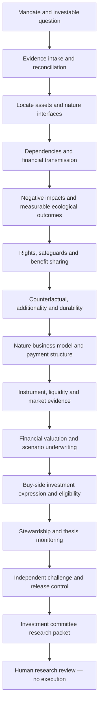

# Nature and Biodiversity Investment Agent workflow



The diagram shows the full specialist route. The bond transition stage applies only to the transition-bond route. Each route in `agent.json` is an explicit sequential DAG: the next stage waits for the prior stage to complete. This design avoids implying automatic independent parallel research. There are no hidden model calls or background agents. See each stage prompt for actual analytical requirements.

## Routes
- `listed-equity`: 14 stages; supported asset types: equity.
- `public-credit`: 14 stages; supported asset types: bond.
- `private-nature-project`: 14 stages; supported asset types: private_project.
- `portfolio-screen`: 14 stages; supported asset types: equity, bond, portfolio.
- `nature-credit`: 14 stages; supported asset types: biodiversity_credit, private_project.

## Operating commands
```bash
python3 -m sf_agent init --request your-request.json --out runs/issuer-01
python3 -m sf_agent next --run runs/issuer-01
# Read the returned packet and actual source documents; write a stage artifact.
python3 -m sf_agent submit --run runs/issuer-01 --stage mandate --artifact mandate.json --revision 0
python3 -m sf_agent status --run runs/issuer-01
```

Repeat `next`, actual research and `submit` using the current revision. Change the stage ID and artifact file as appropriate. A failed stage returns NEEDS_DATA/BLOCKED; do not substitute a fixture to complete it. After a material upstream revision, downstream work and any review are invalidated. Add newly obtained evidence by creating a new request/run; references and source history must not be silently edited.

Human-only review after all substantive work is complete:
```bash
python3 -m sf_agent review --run runs/issuer-01 --reviewer "Accountable reviewer" --decision APPROVE_RESEARCH --rationale "Describe checks actually performed" --revision CURRENT_REVISION --attest-human
```
`CURRENT_REVISION` is a placeholder for the integer in `status`. This command records an attestation, not an authenticated identity or a trade decision. Hosts must never use it to impersonate human review.
